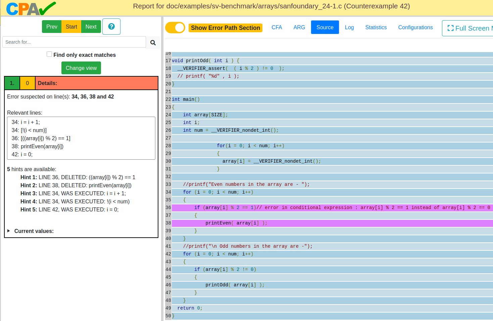

# _Fault Localization in Model Checking_
# Implementation and Evaluation of Fault-Localization Techniques with Distance Metrics

To use the fault-localization techniques, the CPAchecker must be cloned in your computer.
[https://cpachecker.sosy-lab.org/](url) \
Then, you have to build the project using the `ant` command. \
Finally, the program can be run using the following command: \
`scripts/cpa.sh -explainer test/programs/faultlocalization/benchmarks/maxLoop/maxLoop1.c` 
If you add the following property `-setprop explainer.distanceMetric=` in the command above, you can specify which technique you want to use for the fault-localization. \
For example: 
- `-setprop explainer.distanceMetric=PG ` for Automated Path Generation
- `-setprop explainer.distanceMetric=ADM ` for Abstract Distance Metric
- `-setprop explainer.distanceMetric=CFDM ` for Control Flow Distance Metric

The result can be found in the `output` folder in the form of an HTML file, and it looks like this:

On the left side you can take a look at the suggested changes and on the right side you can see the suspicious lines marked with purple.
The **fault** in the code is located at **line 36**, which is the first line that the fault-localization technique indicated as **suspicious**. 

**Abstract**: \
A very often occurrence in the world of software developers are faulty programs. The definition of a faulty program is a program that entails an error in its code.  It is thedeveloper’s job to search, locate, and fix the fault that caused the error. However, thisprocess can be extremely time-consuming.  Model checking is a method that can beused to find out whether a program is faulty or not.  This work discusses the use ofdistance metrics for automatic fault-localization in model checking. When a programdoesn’t  fulfill  its  specification,  the  model  checker  produces  a  counterexample  thatrepresents an instance of an undesirable behavior of the program. We take the generatedcounterexample of a failed program and we compared it with a program execution thatis as close as possible to the counterexample and does not lead to an error. The differencebetween the failed run and the closest to it successful run, should be the fault. However,how close two program executions can be with each other depends on what kind ofmetric is used.  The metrics that are discussed in this work belong to the category ofdistance functions that work with predicate abstraction, which makes the states of aprogram abstract instead of concrete, and that makes the techniques more scalable andenables a more detailed and understandable explanation of why the error occurred. Tocompare the considered techniques, we implemented them in an unifying framework.We conducted an experimental evaluation using 34 benchmarks and compared the threefault-localization techniques with each other in regards to their time and efficiency. Theresults of the evaluation show that using an automated method for fault-localizationpurposes can be very promising and can save for the developer a lot of time.

